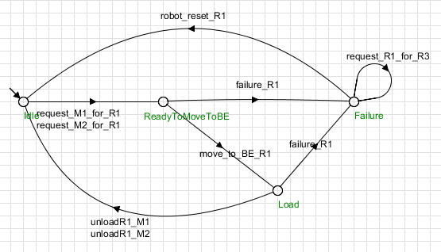

# Controle de Sistema de Robôs Autônomos em Armazém
Autores:
Jezrael Pereira Filgueiras;
José Hélio de Araújo Junior;
Ingrid;
Guilherme.
- Link para vídeo explicativo no youtube:
<https://youtu.be/YsKbvnhOKjo>
## Introdução

Recentemente, com o rápido desenvolvimento da tecnologia e o advento da Indústria 4.0, a necessidade por automatização dos processos industriais por melhor gerenciamento de recursos e tempo, tornou-se evidente no século XXI. No desenvolvimento de sistemas de controle, uma das abordagens mais comuns é a de tratar o sistema como um autômato finito, sujeito a eventos discretos, que alteram o estado do sistema. Nesse tipo de abordagem, cada parte de um sistema, seus estados e eventos possíveis são projetados e desenvolvidos individualmente,  então podem ser combinadas para formar um sistema maior e mais complexo. Para coordenr o comportamento desse tipo de sistema, faz-se necessária a utilização de controle supervisório, projetado para atuar como uma camada de controle sobre o sistema, restringindo e autorizando transições entre estados para evitar comportamentos indesejados
Nesse projeto, é projetado um sistema de controle supervisório para um conjunto de robôs autômatos que operam em um armazém. Cada robô é projetado individualmente, e as restrições e autorizações necessárias são aplicadas para que o sistema opere como um todo de forma harmônica.

## Objetivos

- Modelar o sistema de transporte de insumos com autômatos finitos;
- Implementar um supervisor para controlar o sistema de forma segura e eficaz;
- Simular e validar os sitema em diferentes cenários.
- Relaizar um vídeo explicando o funcionamento do sistema;

## Materiais e Metodologia

Para o projeto dos robôs e do supervisor, foi utilizado o software [Supremica](#referencia-1), que fornece interface gráfica e operações para lidar com autôatos de forma intuitiva, oq ue permite descrever e simular um sistema a eventos discretos.

O sistema deve funcionar conforme as seguintes regras:
- O sistema é composto por três robôs
  - R1: Transporta do Buffer de Entrada(BE) para as máquinas M1 e M2;
  - R2: Transporta do Buffer de Entrada para as máquinas M3 e M4;
  - R3: Substitui qualquer um dos robôs em caso de falha;
- Apenas um robô pode acessar o BE por vez para evitar conflitos na retirada de insumos.
- Se um robô estiver retirando um insumo, o outro deve aguardar.
- Como ambos os robôs passam pelo BE, é necessário um controle para evitar colisões na área.
- Os robôs devem aguardar se o outro estiver no buffer.

A priori, são projetados os autômatos referentes aos robôs, definindo-se seus estados e eventos possíveis, controáveis ou não. A figura 1 ilustra os estados, eventos possíveis e as relações entre eles referentes aos robôs 1 e 2, que possuem o mesmo modo de operação.

  

Os estados definidos para os autômatos R1 e R2 são:
- Idle;
- ReadyToMovetoBE;
- Load;
- WaitChoiceMxorMy;
- UnloadFree;
- Failure

Os eventos possíveis para cada autômato são:
- request_Rx(*uncontrollable*);
- move_to_BE_Rx;
- move_to_machine_area_Rx;
- UnloadRx_Mx;
- UnloadRx_My;
- Failure_Rx (*uncontrollable*);
- robot_reset_Rx;

Ambos os robôs estão por padrão inativos. Qualquer um pode ser acionado a qualquer momento, o que o leva para o estado de request(*ReadytoMovetoBE*), e caso haja uma falha, o autômato fica em um estado de falha, caso não, o robô segue até o buffer de entrada para retirar a carga. A partir daí, o autômato pode falhar, ou entrar no estado de espera(*WaitChoiceMxorMy*). Neste estado, ele pode entrar no esstado se falha ou se dirigir para o estado de descarga, de onde então volta ao estado inativo. Vale ressaltar que a ordem se solicitação de transporte de carga(*request_Rx*) não implica na ordem de recebimento de carga, ou seja, desde que o buffer esteja livre, qualquer robô pode acessá-lo, e sua carga será entregue, ou seja, nenhum robô consegue receber a carga designada a outro robô.

Note que se um dos robôs falhar, o sistema para, uma vez que a carga não pode ser transportada por R2. Para solucionar esse problema, o autômao que representa o comportamento do robô 3 é ilustrado na figura 2.

Os estados do autômato R3 são:
- Idle;
- Replace Rx;
- Load;
- UnloadFree;

Os eventos possíveis do autômato R3 são:
- failure_Rx;
- robot_reset_Rx;
- move_to_BE_R3;
- unload_R3_Mx;

No momento em que qualquer um dos autômatos R1 e R2 entrarem em falha, R3 é ativado, segue para o buffer de entrada, e então trasporta a carga para a máquina designada. Após isso, ele volta ao estado inativo, para esperar por uma nova solicitação, caso o robô continue em falha. Após o robô 3 assumir o papel de um dos outros robôs, este fica impossibilitado de reinicializar, até que o robô três termine o percurso de transporte e volte ao estado *IDLE* 
Note que há eventos que podem ser executados por cada robô simultaneamente, o que pode causar conflitos: O robô 1 e o robô 2 podem se digirir ao buffer ao mesmo tempo, e então colidiriam no buffer de enrada. Dessa forma, faz-se necessário que enquanto um robô se dirija ao buffer de entrada, o outro se mantenha pronto a mover-se. Quando o primeiro robô retira a carga e for transportá-la para a máquina, então o outro robô pode se dirigir ao buffer de entrada. Além disso, já que o robô 3 consegue receber a carga de qualquer outro robô, é necessário controlar para qual máquina o robô 3 deve levar a carga que recebeu do buffer, pois ele receberá a carga do robô que está em estado de falha. Para controlar isso, dois autômato supervisórios devem ser projetados. Esses autômatos são ilustrados nas figura 3 e 4.

Esses autômatos regulam a validade de eventos nos autômatos dos robôs, como invalidar o evento *move_to_BE_Rx*, caso o buffer esteja ocupado, ou os eventos *unload_R3_M1* e *unload_R3_M2*, caso o robô 3 esteja substituindo o robô 2.

## Resultados e Conclusões
Após a adição dos supervisores, ao simular o sistema, caso um dos robôs se dirija ao buffer de entrada e o outro tenha recebido uma solicitação, este não poderá seguir para o buffer de entrada antes que o evento de trasportar a carga para a máquina ocorra no autômato do primeiro robô. Esse processo é ilustrado nas figuras 4 e 5, onde os eventos verdes são os eventos habilitados no estado atual. Note que quando ocorre o evento "EVENTO DE IR PRO BUFFER" ocorre em um autômato, e o outro está no estado de "ESTADO DE ESPERA PARA IR PARA O BUFFER", o evento "EVENTO DE IR PRO BUFFER" está desativado neste autômato, o que resolve o problema de colisão e competição por carga no buffer. Isso ocorre também para o robô 3.

A implementação do robô reserva também funcionou como esperado: O evento "EVENTO DE FALHA" em um dos robôs ativa o robô 3, que recebe a solicitação. caso o evento "REINICIALIZAÇÃO" ocorra, o robô 3 volta ao estado inativo, e o primeiro robô está pronto para receber a solicitação. Caso contrário, o robô 3 se dirige ao buffer, caso não haja outro robô se dirigindo até lá, e então pode transportar a carga. Caso o robô que tenha falhado seja reinicalizado durante esse processo, ele não é reativado, e não pode receber solicitações, até que robô 3 termine o percurso.

Uma observação é que não é possível ocorrer uma falha dupla, em que o robô 1 e o robô 2 estejam em estado de falha simultaneamente, e essa lógica deve ser implementada em ocasiões futuras.

Foi-se capaz de mostrar a partir dessas simulações que o projeto de controle supervisório em um sistema a eventos discretos é eficiente em aplicar restrições e permissões a eventos controláveis em autômatos finitos, e o software foi um facilitador do processo de criar e simular os outômatos e o sistema composto pelos mesmos.

## Referências
1.  > SUPREMICA. Supremica: Supervisor synthesis tool. Disponível em: <https://github.com/robimalik/Supremica>. Acesso em: 11 mar. 2025.
2. Cassandras, C. G., & Lafortune, S. (2007). Introduction to Discrete Event Systems (2ª ed.). Springer. ISBN: 978-0387333328.
