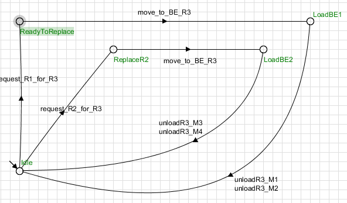
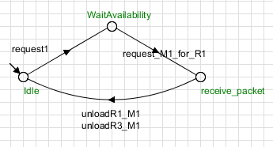
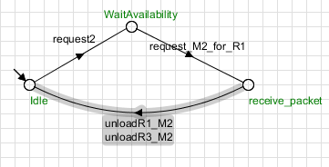

# Controle de Sistema de Robôs Autônomos em Armazém
Autores:
Jezrael Pereira Filgueiras;
José Hélio de Araújo Junior;
Ingrid;
Guilherme.
- Link para vídeo explicativo no youtube:
<https://youtu.be/YsKbvnhOKjo>
## Introdução

Recentemente, com o rápido desenvolvimento da tecnologia e o advento da Indústria 4.0, a necessidade por automatização dos processos industriais por melhor gerenciamento de recursos e tempo, tornou-se evidente no século XXI. No desenvolvimento de sistemas de controle, uma das abordagens mais comuns é a de tratar o sistema como um autômato finito, sujeito a eventos discretos, que alteram o estado do sistema. Nesse tipo de abordagem, cada parte de um sistema, seus estados e eventos possíveis são projetados e desenvolvidos individualmente,  então podem ser combinadas para formar um sistema maior e mais complexo. Para coordenr o comportamento desse tipo de sistema, faz-se necessária a utilização de controle supervisório, projetado para atuar como uma camada de controle sobre o sistema, restringindo e autorizando transições entre estados para evitar comportamentos indesejados
Nesse projeto, é projetado um sistema de controle supervisório para um conjunto de robôs autômatos que operam em um armazém. Cada robô é projetado individualmente, e as restrições e autorizações necessárias são aplicadas para que o sistema opere como um todo de forma harmônica.

## Objetivos

- Modelar o sistema de transporte de insumos com autômatos finitos;
- Implementar um supervisor para controlar o sistema de forma segura e eficaz;
- Simular e validar os sitema em diferentes cenários.
- Relaizar um vídeo explicando o funcionamento do sistema;

## Materiais e Metodologia

Para o projeto dos robôs e do supervisor, foi utilizado o software [Supremica](#referencia-1), que fornece interface gráfica e operações para lidar com autôatos de forma intuitiva, oq ue permite descrever e simular um sistema a eventos discretos. 

O sistema deve funcionar conforme as seguintes regras:
- O sistema é composto por três robôs
  - R1: Transporta do Buffer de Entrada(BE) para as máquinas M1 e M2;
  - R2: Transporta do Buffer de Entrada para as máquinas M3 e M4;
  - R3: Substitui qualquer um dos robôs em caso de falha;
- Caso um robô falhe, o Robô 3 deve assumir seu posto e realizar seu processo de transporte de carga.
Cada máquina processa um tipo de carga diferente, e envia ao robô apropriado um sinal de requisição para transportar a carga específica dessa máquina

A partir do uso do software, foram projetados 7 autômatoo finitos, referentes aos três robôs, e às quatro máquinas do sistema.

A priori, serão tratados aqui os autômatos referentes aos robôs, definindo-se seus estados e eventos possíveis, controáveis ou não. A figura 1 ilustra os estados, eventos possíveis e as relações entre eles referentes aos robôs 1 e 2, que possuem o mesmo modo de operação.

  

Os estados definidos para os autômatos R1 e R2 são:
- Idle;
- ReadyToMovetoBE;
- Load;
- Failure

Os eventos controláveis possíveis para cada autômato são:
- request_Mx_Rx;
- move_to_BE_Rx;
- Unload_Rx_Mx;
- Unload_Rx_My;

Os eventos não controláveis são:
- failure_Rx;
- robot_reset_Rx;

Ambos os robôs estão por padrão inativos. Neste estado, ualquer um pode ser acionado a qualquer momento, o que o leva para o estado de request(*ReadytoMovetoBE*), e caso haja uma falha, o autômato fica em um estado de falha, caso não, o robô segue até o buffer de entrada para retirar a carga. A partir daí, o autômato pode falhar, ou descarregar. O evento de descarga leva o autômato dos robôs de volta ao estado inativo. No estado de falha, o evento de reset também leva os robôs de volta ao estado inativo.
Vale ressaltar que o evento de falah implca na retirada do robô do sistema, de modo que a entrada respectia do buffer não fique ocupada.

Note que se um dos robôs falhar, o sistema para, uma vez que a carga não pode ser transportada. Para solucionar esse problema, o autômao que representa o comportamento do robô 3 é ilustrado na figura 2.

Os estados do autômato R3 são:
- Idle;
- Replace R1;
- Replace R2;
- LoadBE1;
- LoadBE2;

Os eventos controláveis possíveis do autômato R3 são:
- request_Rx_R3;
- move_to_BE_R3;
- unload_R3_Mx;

Após um dos robôs 1 e 2 receberem um request, o R3 se torna apto a tomar suas posições caso ocorra uma falha. Quando isso ocorre, o robô em falha faz o request para o robô três substituí-lo, assim, ele segue para o buffer de entrada, e então trasporta a respectiva carga para a máquina designada. Após isso, ele volta ao estado inativo, para esperar por uma nova solicitação, caso o robô continue em falha. Isso também ocorre para caso ambos os robôs estejam em falha siimultaneamente. Ele é capaz de cumprir a tarefa de um robô e logo após voltar ao estado inativo, receber uma requisição do outro robô que estava em falha, e assim, transportar a carga requisitada a ele.
Trataremos agora dos autômatos das máquinas do sistema, que vão controlar os requests para os robôs 1 e 2. Todas as máquinas possuem a mesma estrutura, mudando apenas o nome dos eventos associados a cada estado. Os autômatos M1 e M2 sao ilustrados nas figuras 3 e 4. Essa estrutura se repete de forma análoga para as máquinas 3 e 4:

 

Os estados dos autômatos das máquinas são:
- Idle;
- WaitAvailability;
- RecievePackage;

Os eventos das máquinas 1 e 2 são:
- Controláveis:
  - request_Mx_for_R1;
  - unload_R1_Mx;
- Não Controláveis:
  - Requestx;

Já para as máquinas 3 e 4, são:
- Controláveis:
  - request_Mx_for_R2;
  - unload_R2_Mx;
- Não Controláveis:
  - Requestx;

Ambas as máquinas iniciam no estado Idle. Quando uma das máquinas 1 e 2 fazem uma requisição para o robô 1, ela segue para o estado de espera, onde caso o robô esteja inativo, ela pode enviar esse request para o robô. Isso se deve porque a máquina deve esperar o robô terminar o percurso de transporte e voltar ao estado inativo, antes de enviar uma requisição para ele. As máquinas voltam ao estado inativo após a ocorrência do evento de descarga do robô. Caso um dos robos venham a falhar, as máquinas se mantém em seu estado atual, até que o robô três transporte a carga até a máquina requisitada.

## Resultados e Conclusões
O sistema obteve o comportamento esperado. Ao simular o sistema, os robôs recebem as requisições de uma das máquinas, e após a retirada da carga, o evento de descarga que é habilitado é o que leva a carga à máquina que fez o request, enquantoq que o evento de descarga para a ma´quina que não fez a solicitação é inativado.

A implementação do robô reserva também funcionou como esperado: O evento "EVENTO DE FALHA" em um dos robôs ativa o robô 3, que recebe a solicitação. Assim, ele se dirige ao buffer de entrada, recebe a carga específica da máquina que havia feito a solicitação e descarrega para a máquina. O robô que falhou, ao reiniciar, volta ao estado inativo.

Uma observação é que não é possível ocorrer uma falha dupla, em que o robô 1 e o robô 2 estejam em estado de falha simultaneamente, e essa lógica deve ser implementada em ocasiões futuras. outra, é que caso o robô reinicie antes que o robô 3 termine o percurso, ele é incapaz de receber uma nova requisição. No entanto, os eventos de requisição são incontroláveis, logo, deve ser implementada uma estratégia que contorne essa situação.

Foi-se capaz de mostrar a partir dessas simulações que o projeto de controle supervisório em um sistema a eventos discretos é eficiente em aplicar restrições e permissões a eventos controláveis em autômatos finitos, e o software foi um facilitador do processo de criar e simular os outômatos e o sistema composto pelos mesmos.

## Referências
1.  > SUPREMICA. Supremica: Supervisor synthesis tool. Disponível em: <https://github.com/robimalik/Supremica>. Acesso em: 11 mar. 2025.
2. Cassandras, C. G., & Lafortune, S. (2007). Introduction to Discrete Event Systems (2ª ed.). Springer. ISBN: 978-0387333328.
